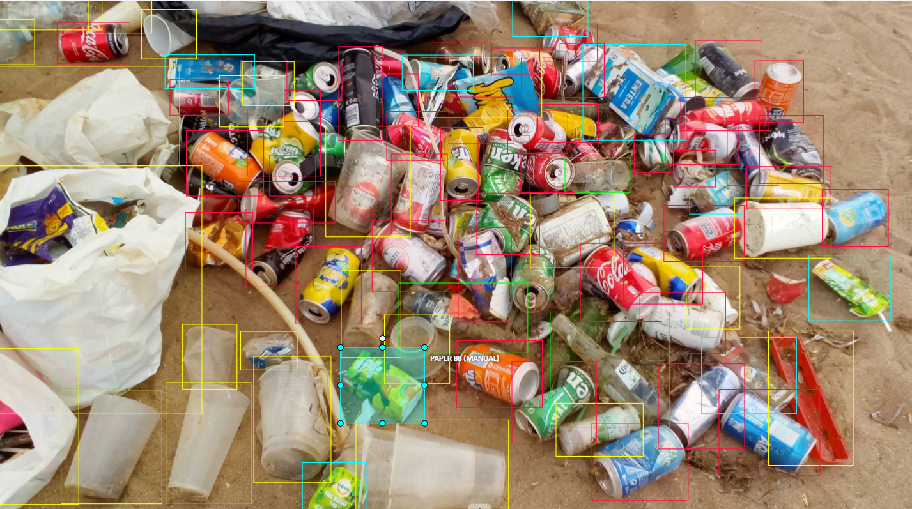
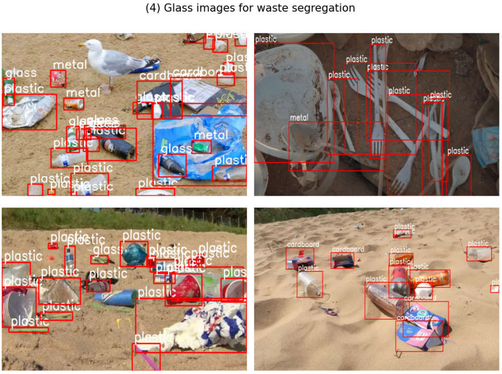
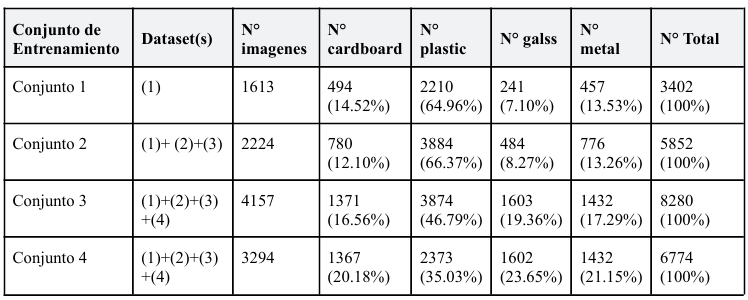

<h2 align="center">DESCRIPTION</h2>

- A **YOLO model trained to detect solid waste on the beach** and classify it into the main categories: "plastic," "cardboard," and "metal."
- Test the model on this **website** 🙌 : [https://beach-litter-detect.streamlit.app/](https://beach-litter-detect.streamlit.app/)
    - Website preview:   
    
<h2 align="center">SUMMARY</h2>

## 1. Image Annotation
- We used **CVAT** as our image annotation tool.

## 2. Datasets

## 2. Challenges
- **Waste Occlusion**:
  - Waste items often overlap or are piled close together, making detection challenging.
  - *Solution*: Added numerous images featuring waste items in close proximity to improve the model's robustness in such scenarios.
- **Class Imbalance**:
  - There was a significant imbalance, with an overwhelming number of plastic waste samples compared to other classes.
  - *Solution*: Balanced the dataset by increasing the number of images for minority classes and reducing the number of plastic waste images.
- **Detection of Humans on the Beach**:
  - The model occasionally detected humans or animals as waste due to their presence in beach images.
  - *Solution*: Included images with people and animals but did not annotate them, using these as negative samples to serve as filters for non-waste objects.

## Training sets

- The **Set 1** consists solely of dataset (1), which includes 1,613 images of waste, with only a small portion depicting beach waste. These 1,613 images contain 3,402 labeled instances, primarily plastic (64.96%), followed by cardboard (14.52%), metal (13.53%), and glass (7.10%).
- In **Set 2,** 611 new images from datasets (2) and (3) were added, focusing on beach waste, increasing the total instances to 5,852. Plastic remained the dominant category, making up around 66% of the waste, while glass remained the least represented at 8%.
- **Set 3** incorporated dataset (4), which focused on glass bottles, increasing the relative frequency of glass waste to 19%.
- Finally, **Set 4** differed by applying undersampling to reduce the quantity of plastic waste. 863 plastic images were removed from "Set 3," reducing the total to 3,294 images. As a result, plastic instances decreased from 3,874 to 2,373, lowering its relative frequency from 47% to 35%.

## 3. Models

- This table shows the **best models** selected along with their respective configurations and parameters for each training set.
-  The Ultralytics library allows importing YOLO models and performing fine-tuning with custom data through a single line of code using the ".train()" method of the corresponding YOLO model.
-  This method enables customization of the training process by modifying certain parameters. Specifically, **five parameters have been manually adjusted in the table**: "epochs," "patience," "dropout," "augment," and "seed." The remaining parameters use the default values provided by the ".train()" method.

## 4. Results

- After testing in various scenarios and analyzing the results, it was observed that two of the developed models performed better, depending on whether they were applied to videos or images. Specifically:
  - **Model 2** was chosen *for video detection*, as it demonstrated superior performance when handling images with a large amount of waste.
  - **Model 3** was more suitable *for static image detection*, achieving an mAP(50) of 0.506.

## 5. Test on images

## 6. Test on video (tracking)

